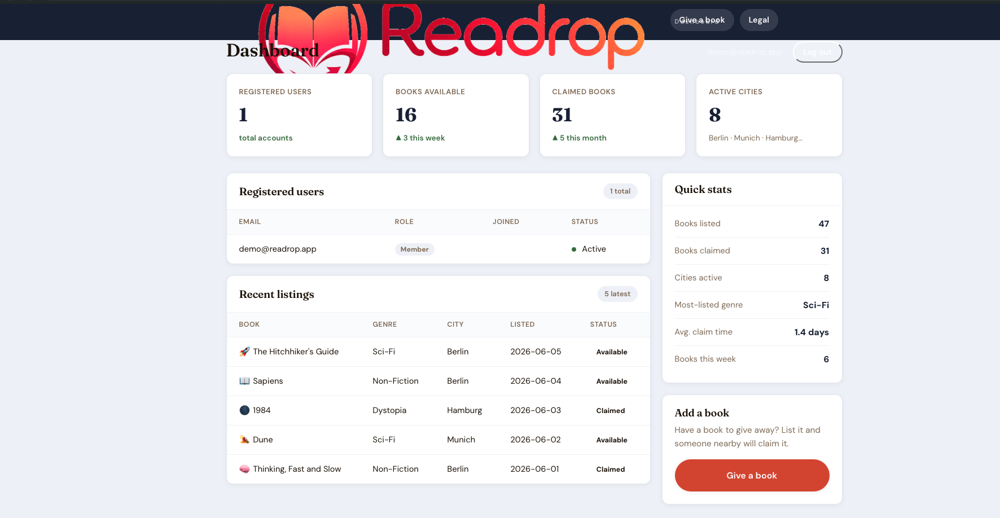

Bug ID: FE-BUG-001
Title: Header logo overlaps dashboard content and navigation items
Page: /dashboard
Severity: High
Priority: High

Precondition:
User is logged in with demo account.

Steps:
1. Open the Readrop frontend.
2. Log in with demo@readrop.app.
3. Navigate to /dashboard.
4. Observe the header/navbar area.

Actual Result:
The Readrop logo is too large and overlaps the dashboard title and navigation area. Navigation items are visually crowded and difficult to read.

Expected Result:
The logo should fit inside the header area. Navigation items should remain readable, aligned, and not overlap with page content.

Notes:
This affects usability and visual quality of the dashboard page.
